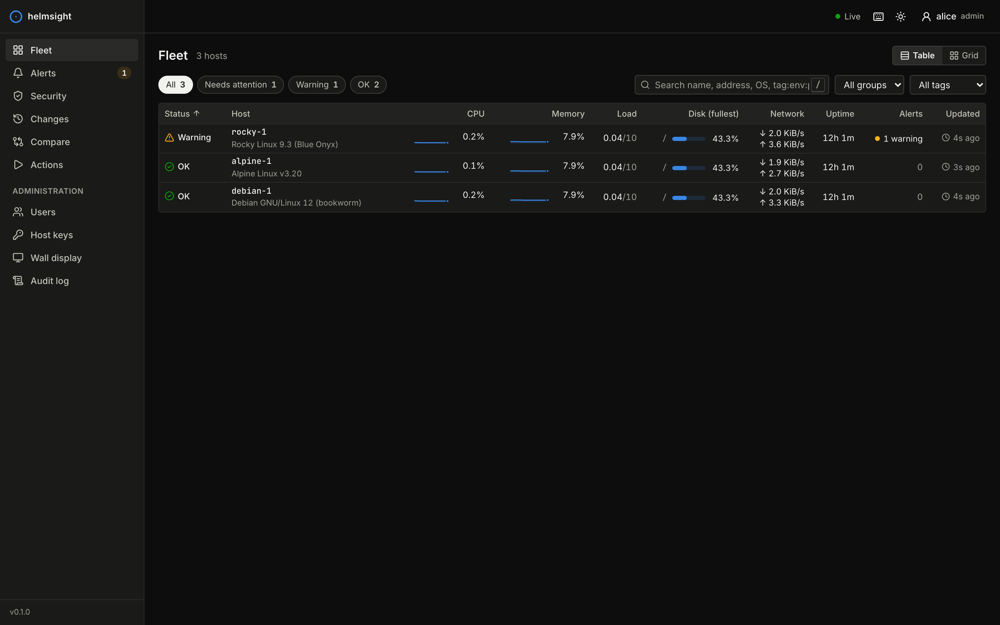
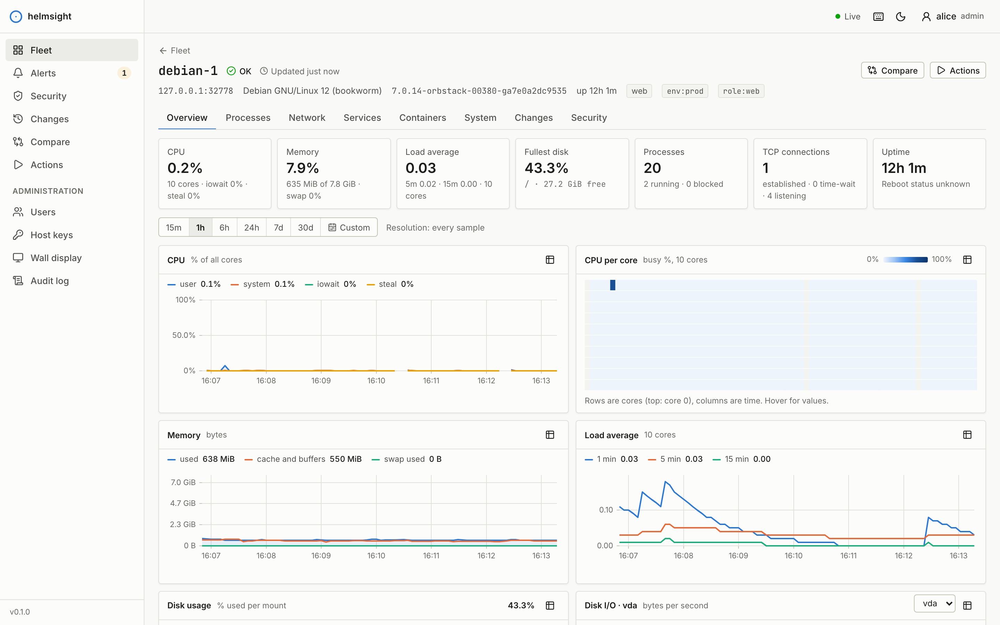
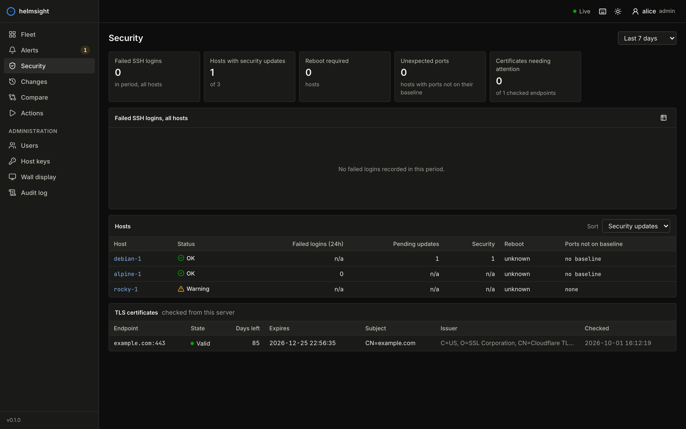
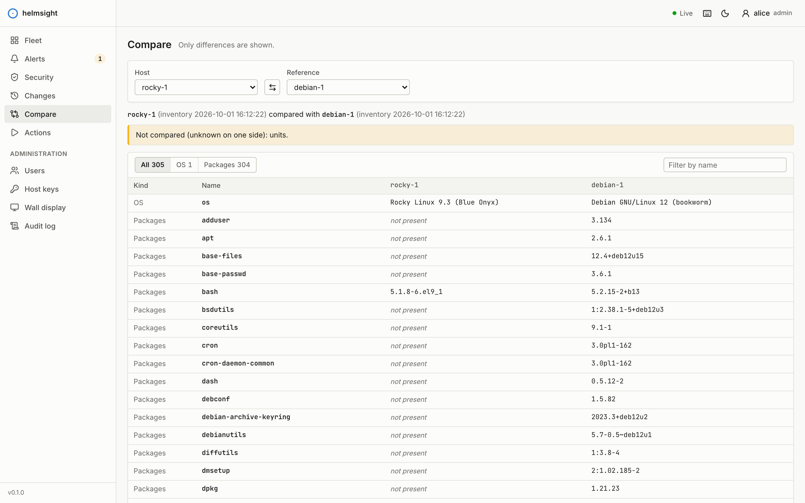
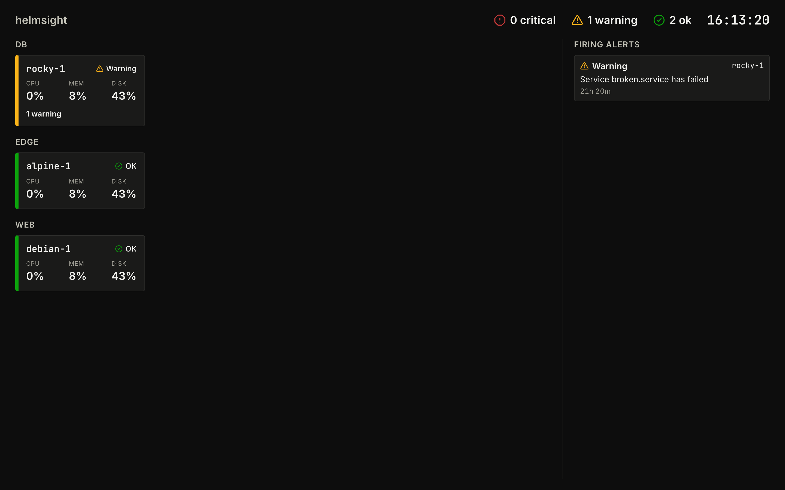

# helmsight

[English](README.md) · **Türkçe**

**Tüm sunucularınızı tek ekrandan izleyin. Sunuculara hiçbir şey kurmayın.**

helmsight, Linux sunucu filoları için ajansız (agentless) ve kendi
altyapınızda çalışan bir web paneli. Merkezdeki tek bir makinede çalışan tek
bir program sunucularınıza sıradan SSH ile bağlanır, metrikleri ve envanteri
yalnızca okuma yapan komutlarla toplar, geçmişi gömülü bir veritabanında
saklar ve hızlı bir web arayüzü sunar. İzlenen sunuculara hiçbir şey
kurulmaz, kopyalanmaz ve yazılmaz.

> [!NOTE]
> **Durum: erken geliştirme aşaması (0.x).** helmsight yeni bir proje.
> Debian, Ubuntu, Rocky, Fedora, openSUSE ve Alpine üzerinde test ediliyor;
> ancak üretim ortamında henüz az kullanıldı ve bağımsız bir güvenlik
> denetiminden geçmedi. Yapılandırma seçenekleri, API ve veritabanı biçimi
> 0.x sürümleri arasında değişebilir. Önce kritik olmayan sunucularda
> deneyin, veri dizininin yedeğini alın ve yaygın olarak kullanmadan önce
> [güvenlik modelini](docs/tr/security.md) ve
> [toplama betiğini](crates/collect/src/remote.sh) inceleyin. Veri toplama
> yalnızca okuma yapar; isteğe bağlı Eylemler (Actions) özelliği ise sizin
> yapılandırdığınız komutları çalıştırır, bu yüzden dikkatle etkinleştirin.
> helmsight [MIT lisansı](LICENSE) altında, olduğu gibi ve hiçbir garanti
> verilmeden sunulur; kullanımdan doğan sorumluluk kullanıcıya aittir.

**Web sitesi ve Türkçe belgeler: https://enderkus.github.io/helmsight/tr/**



| | |
|---|---|
|  |  |
|  |  |

## Neler yapar

- **Filo görünümü**: her sunucu için durum, CPU, bellek, yük, en dolu disk,
  ağ, çalışma süresi ve alarmlar; gruplar, etiketler, arama ve küçük eğilim
  grafikleri. "Sunucu erişilemiyor", "SSH kimlik doğrulaması başarısız",
  "sunucu anahtarı değişti" ve "veri kısmen toplanabildi" ayrı durumlardır;
  böylece bir ağ sorununu bir hesap sorunundan veya olası bir güvenlik
  olayından hemen ayırt edersiniz.
- **Sunucu ayrıntısı**: canlı ve geçmiş grafikler (iowait ve steal dahil
  CPU, çekirdek başına ısı haritası, bellek ve swap, yük, disk doluluğu ve
  G/Ç, ağ, TCP), en çok kaynak kullanan süreçler, dinlenen portlar ve sahip
  süreçleri, systemd veya OpenRC servisleri, Docker ve Podman konteynerleri
  ve sistem bilgileri.
- **Geçmiş**: varsayılan olarak 24 saat ham veri, 7 gün dakikalık ve 90 gün
  beş dakikalık özetler; hepsi SQLite içinde. 15 dakikadan 30 güne kadar
  zaman aralıkları ve tüm grafiklerde eş zamanlı hareket eden imleç.
- **Sapma (drift) ve değişiklik takibi**: paketler, çekirdek, dinlenen
  portlar, etkin servisler ve işletim sistemi sürümü 15 dakikada bir
  kaydedilir. İki sunucuyu veya bir sunucuyu referansıyla (baseline)
  karşılaştırın, dünden beri neyin değiştiğini görün.
- **Güvenlik görünümü**: zaman içinde başarısız SSH girişleri, bekleyen
  (güvenlik) güncellemeleri, referans sunucuda olmayan portlar, yeniden
  başlatma gerektiren sunucular ve TLS sertifikalarının bitiş tarihleri.
- **Alarmlar**: sunuculara, gruplara veya etiketlere göre kapsamlanan
  `disk_used_pct > 90 for 10m` gibi kurallar; erişilemeyen sunucular,
  sunucu anahtarı sorunları, başarısız servisler ve sertifika süresi için
  yerleşik kurallar; onaylama, susturma ve webhook, Slack uyumlu webhook
  veya e-posta ile bildirim.
- **Eylemler** (isteğe bağlı): operatörlerin nginx'i yeniden başlatmak gibi
  önceden onaylanmış birkaç komutu, onay penceresi ve yalnızca eklenebilen
  bir denetim kaydıyla çalıştırması. Yapılandırılmadığında tamamen gizlidir.
- **Kullanıcılar**: izleyici (viewer), operatör ve yönetici rolleri;
  Argon2id ile yerel hesaplar ve isteğe bağlı TOTP; rol eşlemeli OpenID
  Connect tek oturum açma (SSO).
- **Duvar ekranı**: TV ve NOC ekranları için, gruplarla sınırlanmış ve iptal
  edilebilir bir belirteçle açılan salt okunur durum ekranı.
- **Entegrasyonlar**: OpenAPI belgeli sürümlü JSON API, sunucu gönderimli
  olaylar (SSE) ve Prometheus `/metrics` uç noktası.

## Nasıl ajansız ve güvenli kalır

- **Her turda tek, salt okunur bir POSIX kabuk betiği.** Her veri toplama,
  kalıcı bir oturum üzerinde `sh -s` komutunun tek bir SSH çalıştırmasıdır.
  Betik standart girdi üzerinden gönderilir; bu yüzden uzak sunucunun
  süreç listesinde görünmez ve diske yazılmaz. `/proc`, `df`, `ps`, `ss`,
  `systemctl`, paket veritabanı gibi salt okunur kaynakları okur. Hiçbir
  zaman dosya yazmaz; bir araç eksikse veya izin yoksa gerekçesiyle "n/a"
  gösterir. Debian, Ubuntu, RHEL/Rocky/Alma, Fedora, openSUSE ve Alpine
  (BusyBox) üzerinde çalışır.
- **Tarayıcı yalnızca helmsight'ın sunduğu kodu çalıştırır.** Uzak
  sunucular düz metin döndürür; bu metin Rust ile ayrıştırılır ve boyutu
  sınırlanır. Uzak çıktı asla HTML olarak işlenmez ve sıkı bir İçerik
  Güvenliği Politikası (CSP) satır içi betikleri ve stilleri yasaklar.
- **Arayüzden komut çalıştırılamaz.** Terminal, dosya yöneticisi veya komut
  kutusu yoktur. Eylemler, bir yöneticinin yapılandırma dosyasına yazdığı
  sabit komutlardır; arayüz yalnızca bir eylem ve bir sunucu seçebilir.
- **Sunucu anahtarları doğrulanır.** OpenSSH `known_hosts` kuralları
  geçerlidir: bilinmeyen anahtarlar bir yönetici parmak izini onaylayana
  kadar (veya siz accept-new davranışını açmadıkça) reddedilir; değişen
  anahtarlar her zaman reddedilir.
- **Güvenli varsayılanlar.** helmsight yalnızca `127.0.0.1` adresinde
  dinler; başka adreslerde TLS'i kendiliğinden açar. Çerezler HttpOnly ve
  SameSite=Strict'tir, durum değiştiren her istek bir CSRF belirteci
  gerektirir, oturum açma denemeleri sınırlandırılır ve gizli değerler
  XChaCha20-Poly1305 ile şifrelenerek saklanır.

Tehdit modeli, sunucularda çalıştırılan komutların tam listesi ve kısıtlı
bir izleme hesabının nasıl oluşturulacağı için
[docs/tr/security.md](docs/tr/security.md) belgesini okuyun.

## Hızlı başlangıç

Tek bir Linux makinede, SSH olmadan deneyin:

```sh
curl -LO https://github.com/enderkus/helmsight/releases/latest/download/helmsight-x86_64-unknown-linux-musl.tar.gz
tar xzf helmsight-x86_64-unknown-linux-musl.tar.gz
cd helmsight-x86_64-unknown-linux-musl
./helmsight serve --local
```

Terminalde yazan kurulum bağlantısını açarak ilk yöneticiyi oluşturun.
ARM sunucularda `x86_64` yerine `aarch64` kullanın.

Bir sunucu filosunu izlemek için:

```sh
./helmsight init                      # yapılandırma dosyası, anahtar dosyası, ilk yönetici
$EDITOR helmsight.toml                # [[hosts]] kayıtlarını ekleyin
./helmsight hosts test --trust        # SSH'yi deneyin, sunucu anahtarlarını onaylayın
./helmsight serve
```

İzlenen her sunucuda, helmsight'ın açık anahtarıyla yetkisiz bir hesap
oluşturun (bkz.
[İzleme hesabını oluşturmak](https://enderkus.github.io/helmsight/tr/docs/security.html#izleme-hesabını-oluşturmak)).
Kalıcı bir kurulum için
[examples/helmsight.service](examples/helmsight.service) dosyasındaki
sıkılaştırılmış systemd birimini veya konteyner imajını kullanın:

```sh
docker run -d -p 8443:8080 -v helmsight:/var/lib/helmsight \
  -v /etc/helmsight:/etc/helmsight:ro ghcr.io/enderkus/helmsight
```

Konteynerde `listen = "0.0.0.0:8080"` ve `data_dir = "/var/lib/helmsight"`
ayarlayın; TLS bu durumda kendiliğinden açılır (sertifika vermezseniz
kendinden imzalı). İmajda yalnızca statik program bulunduğu için `--local`
kipi bu imajda kullanılamaz.

Adım adım anlatım için
[Türkçe belgelerdeki hızlı başlangıç](https://enderkus.github.io/helmsight/tr/docs/quick-start.html)
ve [sunucuları izlemeye almak](https://enderkus.github.io/helmsight/tr/docs/fleet-setup.html)
sayfalarına bakın.

## Yapılandırma

helmsight tek bir TOML dosyası okur (`--config`, `$HELMSIGHT_CONFIG`,
`/etc/helmsight/helmsight.toml` veya `./helmsight.toml`). Sunucular aynı
dosyada, ayrı bir envanter dosyasında tutulabilir ya da `~/.ssh/config`
dosyasından içe aktarılabilir. En küçük yapılandırma:

```toml
[server]
listen = "127.0.0.1:8080"
data_dir = "/var/lib/helmsight"

[ssh]
user = "monitor"
identity_files = ["/etc/helmsight/id_ed25519"]

[[hosts]]
name = "web-1"
address = "10.0.0.11"
groups = ["web"]
tags = ["env:prod"]

[[alerts.rules]]
id = "disk-full"
expr = "disk_used_pct > 90 for 10m"
severity = "critical"
```

`helmsight config check` dosyayı doğrular ve her sorunun tam satırını ve
anahtarını gösterir:

```text
error: /etc/helmsight/helmsight.toml:17:1: `alerts.rules[0].expr`: unknown metric `disk_used`; available: cpu_pct, ...
```

- [examples/helmsight.toml](examples/helmsight.toml) her seçeneği
  yorumlarıyla gösterir.
- [docs/tr/configuration.md](docs/tr/configuration.md) tam başvurudur:
  bölümler, alarm kurallarında kullanılabilen metrikler, komut satırı, API
  ve ortam değişkenleri.

### Komut satırı

| Komut | Amaç |
|---|---|
| `helmsight serve [--local] [--listen ADRES] [--data-dir DİZİN]` | Sunucuyu ve veri toplayıcıları çalıştırır |
| `helmsight init` | Yapılandırma, anahtar dosyası ve ilk yöneticiyi oluşturur |
| `helmsight user add\|remove\|reset-password\|list` | Yerel hesapları yönetir |
| `helmsight hosts test [--trust] [AD...]` | Bağlantıyı, kimlik doğrulamayı ve sunucu anahtarlarını denetler |
| `helmsight config check` | Yapılandırmayı ve saklanan gizli değerleri doğrular |
| `helmsight secret set\|list\|delete` | `secret:<ad>` olarak başvurulan şifreli gizli değerleri yönetir |
| `helmsight audit verify` | Denetim kaydının özet zincirini doğrular |

## Sık sorulan sorular

**Neden ajan yok?** Ajanların her sunucuya kurulması, güncellenmesi,
yapılandırılması ve güvenilmesi gerekir; ayrıca saldırı yüzeyini
genişletirler. SSH zaten oradadır, zaten sıkılaştırılmıştır ve zaten
denetlenir. helmsight birkaç saniyede bir salt okunur bir oturum ekler.

**Sunucuya ne kadar yük bindirir?** 5 saniyede bir `/proc` altındaki
dosyaları okuyan ve birkaç hafif aracı çalıştıran kısa bir kabuk betiği:
birkaç milisaniyelik CPU zamanı. Bekleyen güncellemeler gibi pahalı
denetimler 6 saatte bir çalışır.

**root gerekir mi?** Hayır. Bu işe ayrılmış yetkisiz bir hesap önerilir.
Birkaç ayrıntı ek izin ister: başarısız girişler için günlüğe okuma erişimi
(`systemd-journal` veya `adm` grubu) gerekir; dinlenen soketlerin sahibi
olan süreçler yalnızca hesabın kendi süreçleri için görünür; Docker
konteynerleri Docker soketine erişim gerektirir ve bu root'a eşdeğerdir.
helmsight okuyamadığı her şey için gerekçesiyle "n/a" gösterir.

**Sunuculara gerçekten hiçbir şey yazmıyor mu?** helmsight'ın komutları
hiçbir şey yazmaz; bu, altı dağıtımda çalışan bir entegrasyon testiyle
doğrulanır. Sunucunun kendi giriş kayıtları (wtmp, lastlog, journal ve
Ubuntu'nun hesabın ev dizinindeki `pam_motd` işareti) SSH girişlerini her
zamanki gibi kaydeder. `dnf` ve `yum` her zaman günlük dosyası yazdığı için
RHEL ailesindeki sunucularda bekleyen güncellemeler yalnızca
`collect.dnf_updates = true` ayarlandığında listelenir.

**Atlama sunucusu (jump host) kullanabilir miyim?** Henüz değil. İçe
aktarılan SSH yapılandırmasında `ProxyJump` olan sunucular uyarıyla atlanır.

**Kaç sunucuyu kaldırabilir?** Veri toplama eşzamanlıdır; sunucu başına bir
kalıcı oturum ve ayarlanabilir bir üst sınır vardır. Depolama, her turda
sunucu başına tek ve kompakt bir satır kullanır. Küçük bir sanal makinede
birkaç yüz sunucunun sorunsuz izlenmesi beklenir.

**Arayüz Türkçe mi?** Arayüz şimdilik İngilizcedir; belgeler hem
İngilizce hem Türkçedir.

**Koyu tema var mı?** Evet. Arayüz işletim sisteminin tercihine uyar; üst
çubuktan değiştirebilirsiniz.

Daha fazlası için
[SSS](https://enderkus.github.io/helmsight/tr/docs/faq.html) ve
[sorun giderme](https://enderkus.github.io/helmsight/tr/docs/troubleshooting.html)
sayfalarına bakın.

## Kaynaktan derleme

Gereksinimler: Rust (stable), Node.js 22 ve npm.

```sh
(cd web && npm ci && npm run build)
cargo build --release
./target/release/helmsight --help
```

Web arayüzü derleme sırasında programın içine gömülür. Geliştirme, testler
ve proje yapısı için [docs/tr/contributing.md](docs/tr/contributing.md)
belgesine bakın.

## Lisans

MIT. Bkz. [LICENSE](LICENSE).
